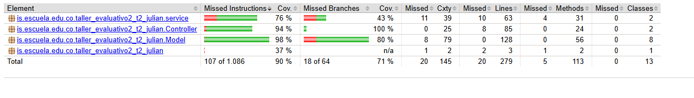
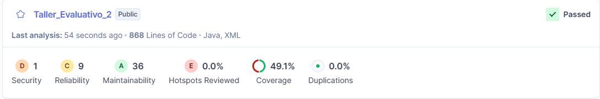
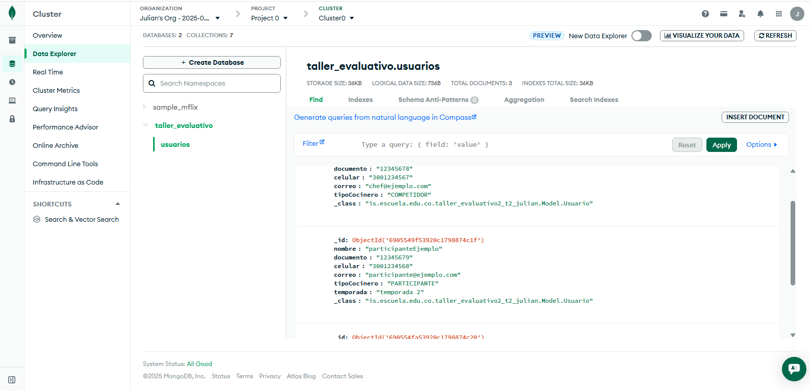
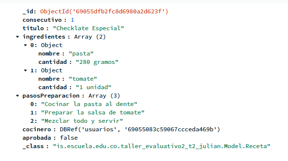
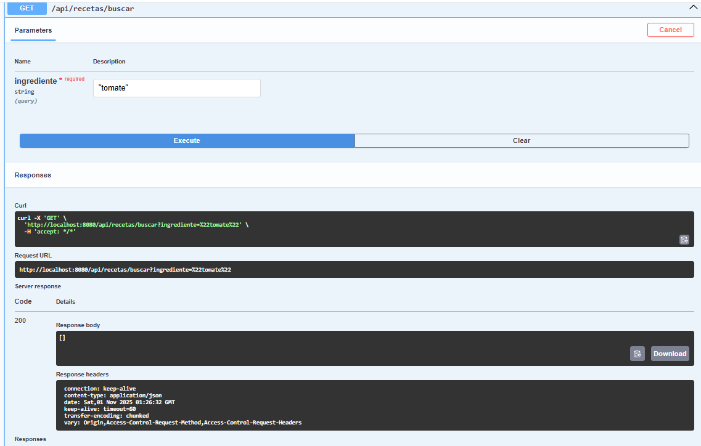

# Taller evaluativo 2

## Julián Eduardo Arenas Alfonso

### Porblema

Se necesita una API, la cual pueda gestionar las recetas de cocina que dan los chefs, participantes y televidentes.
Es una plataforma web la cual debe ser interactiva para los usuarios. Esta API necesita:

- Registrar las recetas de todos los usuarios (televidentes, chef y participantes).
- Consultar las recetas.
- Actualizar las recetas.
- Eliminar las recetas.

### Flujo de ramas

En este caso nosotros desarrollamos el siguiente flujo de rramas:

Feacture: El cual tendra las creaciondes de clases. Y esta se dividira en los diferentes paquetes que hay.
Fix: La cual tendra las actualizaciones o modificaciones de las clases. Se dividira en los diferentes paquetes que hay.
Doc: la cual tendra todas las actualizaciones del README.
Test: la cual tendra la creacion o correccion de las pruebas unitarias.

### Tecnologías usadas

- Java 17
- Spring Boot
- Maven
- JUnit 5
- Mockito
- MongoDB
- Jacoco
- SonarQube

### Estructura de paquetes

- controller: Contiene las clases encargadas de manejar las solicitudes HTTP y las respuestas.
- service: Contiene las clases que implementan la lógica de negocio de la aplicación.
- repository: Contiene las interfaces que definen las operaciones de acceso a datos.
- model: Contiene las clases que representan las entidades del dominio de la aplicación.

### Patrones y principios usados

*PATRONES DE DISEÑO*

- Principio Factory: Se utiliza para crear instancias de objetos sin exponer la lógica de creación al cliente.
- Pattern Repository: Se utiliza para abstraer la lógica de acceso a datos y proporcionar una interfaz más limpia para
la capa de servicio.

*Principios SOLID*

- Single Respondability: Cada clase tiene una única responsabilidad.
- Open/Closed: Las clases están abiertas para la extensión pero cerradas para la modificación. (UsuarioFactory, 
- RecetaFactory )

### Instrucciones para ejecutar el proyecto

1. Clonar el repositorio: En este caso creamos un repositorio, el cual clonamos en la termina, dejandolo en la carpeta 
que queramos con git clone "enlace del repositorio", y luego lo abrimos en intellij en nuestro caso.
2. Configurar MongoDB: Asegurarse de tener una instancia de MongoDB en ejecución. Puedes usar MongoDB Atlas o instalar 
MongoDB localmente.
   
3. Configurar las propiedades de la aplicación: En el archivo application.properties, configurar la cadena de conexión

4.Creacion de la aplicacion: Creamos los paquetes correspondientes, agregandoles las clases necesarias para cada necesitas 
o problema.

5. Test: Implementamos los test, los cuales tendran que pasar la cobertura de Jacoco y SOnarQube.

6. Ejecutar la aplicación: Ejecutar la aplicación Spring Boot desde tu IDE o usando el comando Mvn spring-boot:run

7. Desplegar la aplicación: Una vez se compruebe que funciona la aplicacion con mongoDB, podremos realizar el despliegue
en azure u otra plataforma de nube.

### Coberturas

#### JACOCO

#### SONARQUBE

### MONGOBD

### Taller

Validar que se registra una receta.

Validar busqueda por ingrediente.

